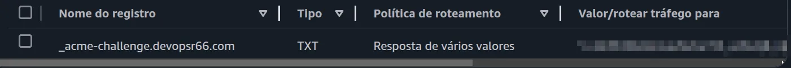
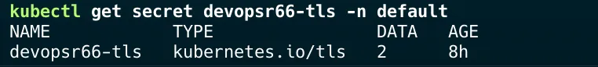
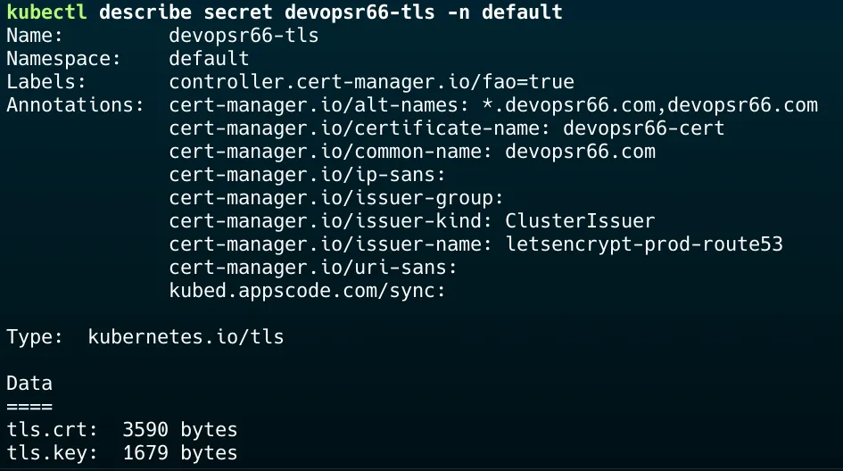
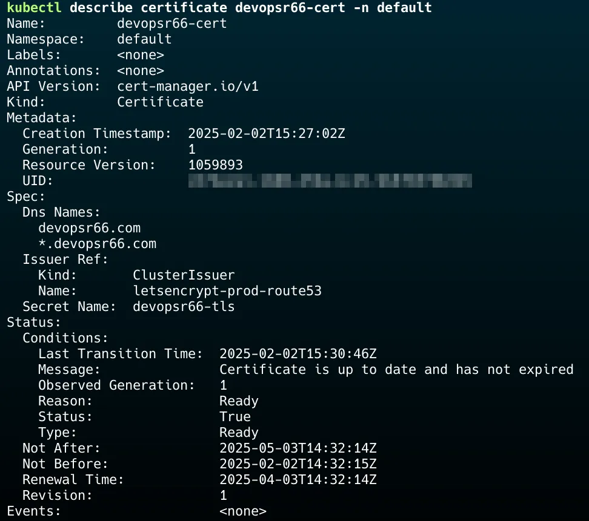
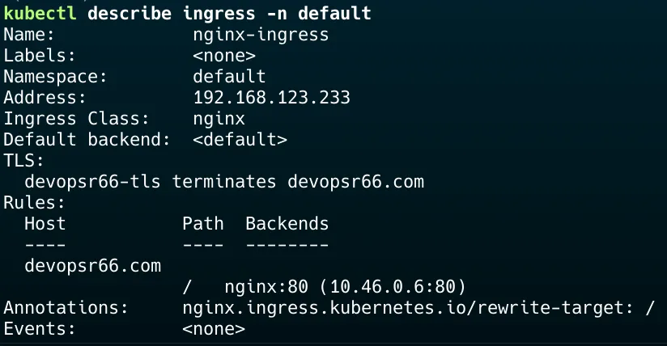
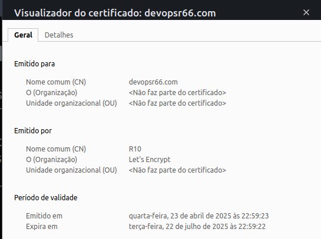

## O que é o cert-manager?

O cert-manager é um controlador nativo do Kubernetes que automatiza a criação, renovação e gerenciamento de certificados SSL/TLS. Ele facilita a integração com Autoridades Certificadoras (CAs), como o Let’s Encrypt, permitindo que os certificados sejam emitidos e renovados automaticamente dentro de um cluster Kubernetes.

Ele é essencial para manter conexões seguras em apliações expostas via ingress controllers, como o NGINX Ingress, Traefik ou Istio.

## Como ele funciona?
O cert-manager gerencia certificados no Kubernetes por meio do Custom Resource Definitions (CRDs), que permitem definir regras para emissão e renovação de certificados. Ele opera em quatros etapas principais:

**1 — Issuer/ClusterIssuer**

* Define a CA responsável pela emissão dos certificados.
* Pode ser um Issuer (válido apenas no namespace onde foi criado) ou um ClusterIssuer (válido em todo o cluster).

**2 — Solicitação de Certificados (Certificate)**

* Define um recurso Certificate para solicitar certificados com base no Issuer ou ClusterIssuer.

**3 — Validação do domínio**

* O cert-manager usa desafios ACME (HTTP-01 ou DNS-01) para validar a posse do domínio.

**4 — Emissão e renovação automática**

* O certificado é armazenado como um Secret no Kubernetes e é automaticamente renovado antes do vencimento.

## O que é o Let’s Encrypt?

O Let’s Encrypt é uma Autoridade Certificadora (CA) gratuita e automatizada que fornece certificados SSL/TLS para proteger aplicações com criptografia HTTPS. Ele é amplamente utilizado para garantir conexões seguras na web sem a necessidade de comprar certificados de outras CAs pagas.

### Como ele funciona?

O Let’s Encrypt utiliza um protocolo chamado ACME (Automated Certificate Management Environmet), que permite a emissão e renovação automática dos certificados. O processo ocorre em três etapas principais:

**1 — Validação do Domínio**

* O Let’s Encrypt verifica se você realmente tem controle sobre o domínio para o qual deseja emitir o certificado.

* Isso pode ser feito de três maneiras:

    1 - **HTTP-01:** Um arquivo temporário é criado no servidor web para ser acessado pelo Let’s Encrypt.

    2 - **DNS-01:** Um registro TXT é adicionado ao DNS do domínio. (No nosso exemplo iremos usar esse modo)
    
    3 - **TLS-ALPN-01:** Um certificado especial é servido via TLS.

**2 — Emissão do Certificado**

* Após validar o domínio, o Let’s Encrypt emite um certificado SSL/TLS válido por 90 dias.

**3 — Renovação automática**

* Ferramentas como cert-manager podem ser configurados para renovar os certifiados automaticamente antes do vencimento.


## 🛠️ Passo a Passo Configuração

Nosso nosso exemplo iremos utilizar um domínio hospedado na AWS Route53.

**1 — Cria uma Secret com as credenciais da conta da AWS:**

Execute o comando abaixo para criar a secret:

```bash
kubectl create secret generic route53-credentials-secret \
  --from-literal=access-key-id=SEU_ACCESS_KEY \
  --from-literal=secret-access-key=SEU_SECRET_KEY \
  -n cert-manager
```

**2 — Instalar o cert-manager:**

O cert-manager pode ser instalado via Helm utilizando os comandos abaixo:

```bash
helm repo add jetstack https://charts.jetstack.io
helm repo update
helm install cert-manager jetstack/cert-manager \
  --namespace cert-manager \
  --create-namespace \
  --set installCRDs=true
```

Verifica se os pods do cert-manager estão rodando com o comando abaixo:

```bash
kubectl get pods -n cert-manager
```

**3 - Criar o ClusterIssuer**

Agora, crie o ClusterIssuer usando o Route53 como solver e aplique no cluster.

### Exemplo Arquivo YAML: clusterIssuer-route53.yaml

```yaml
apiVersion: cert-manager.io/v1
kind: ClusterIssuer
metadata:
  name: letsencrypt-prod-route53
spec:
  acme:
    server: https://acme-v02.api.letsencrypt.org/directory
    email: admin@devopsr66.com
    privateKeySecretRef:
      name: letsencrypt-prod-route53
    solvers:
    - dns01:
        route53:
          region: us-east-1  
          hostedZoneID: "ZXXXXXXXXXXXX" #Substitua pelo Hosted Zone ID do seu domínio
          accessKeyIDSecretRef:
            name: route53-credentials-secret  #Nome da secret do passo 1.
            key: access-key-id
          secretAccessKeySecretRef:
            name: route53-credentials-secret  #Nome da secret do passo 1.
            key: secret-access-key
```

Após criar o clusterissuer, você deverá ver um registro no Route53, como:



**4 — Emitir um Certificado**

Agora, crie um certificado para seu domínio e aplique no cluster.

### Exemplo Arquivo YAML: certificate-route53.yaml

```yaml
apiVersion: cert-manager.io/v1
kind: Certificate
metadata:
  name: devopsr66-cert  # Nome do seu certificado.
  namespace: default    # Namespace que a secret será criado.
spec:
  secretName: devopsr66-tls         # Nome da sua secret com o certificado.
  issuerRef:
    name: letsencrypt-prod-route53   # Nome do seu ClusterIssuer criado no passo 2
    kind: ClusterIssuer
  dnsNames:
    - devopsr66.com      # Coloque seu domínio.
    - "*.devopsr66.com"  # Coloque um wildcard do seu domínio)
```

## Passos para verificar a configuração do certificado

**1 — Certifique-se de que o certificado está armazenado na Secret criada, como devopsr66-tls**

Comando para verificar as secrets criadas:

```bash
kubectl get secret devopsr66-tls -n default
```

Você deve ver algo como:



**2 — A Secret deve conter os certificados e a chave privada**

Comando para verificar os detalhes da secret:

```bash
kubectl describe secret devopsr66-tls -n default
```

Você deve ver algo como:




Para verificar o certificado criado execute o comando abaixo:

```bash
kubectl describe certificate devopsr66-cert -n default
```

Você deve ver algo como:




## Passo a Passo para testar o certificado

**1— Cria um Ingress com o certificado SSL/TLS**

### Exemplo Arquivo YAML: ingress.yaml

```yaml
apiVersion: networking.k8s.io/v1
kind: Ingress
metadata:
  name: nginx-ingress
  annotations:
    nginx.ingress.kubernetes.io/rewrite-target: /
spec:
  ingressClassName: nginx
  rules:
  - host: devopsr66.com  # Substitua pelo seu domínio
    http:
      paths:
      - path: /
        pathType: Prefix
        backend:
          service:
            name: nginx
            port:
              number: 80
  tls:
  - hosts:
    - devopsr66.com  # Substitua pelo seu domínio
    secretName: devopsr66-tls  # Nome do Secret gerado pelo cert-manager
```

Aplique o arquivo no cluster

Para verificar o ingress criado no cluster utilize o comando abaixo:

```bash
kubectl describe ingress -n default
```

Você deve ver algo como:




**2— Cria um Pod e um Serviço para testar o certificado funcionando**

### Exemplo Arquivo YAML: pod.yaml

```yaml
apiVersion: v1
kind: Pod
metadata:
  name: nginx
  namespace: default
  labels:
    app: nginx
spec:
  containers:
  - name: nginx
    image: nginx:latest
    ports:
    - containerPort: 80
```

### Exemplo Arquivo YAML: service.yaml

```yaml
apiVersion: v1
kind: Service
metadata:
  name: nginx
  namespace: default
spec:
  selector:
    app: nginx
  ports:
    - protocol: TCP
      port: 80
      targetPort: 80
  type: ClusterIP
```

Abre a url no navegador e verifica se o certificado foi carregado conforme a imagem abaixo:




🔗 Todos os arquivos utilizados neste artigo estão disponíveis em:
  
[https://github.com/lotechdevops/cert-manager](https://github.com/lotechdevops/config-examples/tree/main/cert-manager)
