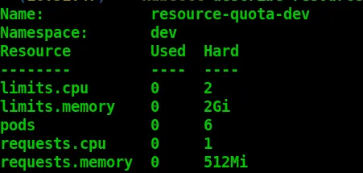
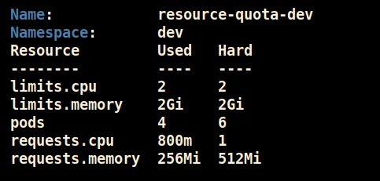
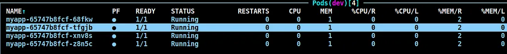

## O que é o ResourceQuota?

O ResourceQuota no Kubernetes é uma ferramenta para gerenciar e limitar o uso de recursos em um namespace. Ele garante que equipes ou aplicações compartilhem os recursos de forma controlada dentro de um cluster. Com o ResourceQuota, é possível definir limites máximos para memória, CPU, armazenamento, quantidade de objetos como pods, serviços, volumes, entre outros.
Isso é útil em ambientes com múltiplos usuários ou aplicações, prevenindo que uma única aplicação consuma todos os recursos do cluster. O ResourceQuota trabalha em conjunto com as configurações de Requests e Limits, que são definidas nos contêineres.

## Tipos de Recursos Suportados

Você pode incluir diferentes tipos de recursos no ResourceQuota

#### Recursos computacionais

- requests.cpu, requests.memory
- limits.cpu, limits.memory

#### Recursos de armazenamento

- requests.storage
- Limite por StorageClass (persistentVolumeClaims, storageclass.<name>.resquests.storage)

#### Quantidade de objetos

- Número máximo de pods (pods), serviços (services), ingress (ingresses), ConfigMaps (configmaps), Secrets (secrets), entre outros.

## Principais Benefícios

- Controle de recursos no nível de namespace.
- Prevenção contra abuso de recursos.
- Melhor gerenciamento de custos em clusters compartilhados.

## Recomendações

- **Analise o uso do namespace:** Garanta que os limites do ResourceQuota atendem à carga esperada.
- **Planeje os recursos dos pods:** Certifique-se de que os requests e limits sejam otimizados para evitar disperdício ou restrições desnecessárias.
- Use ferramentas como o kubectl describe quota <quota-name> para verificar o consumo atual e entender melhor os limites impostos.

## Como ResouceQuota interage com Requests e Limits?

O ResouceQuota funciona como uma política agregada no nível do namespace, enquanto Requests e Limits são aplicados no nível do pod ou contêiner. Se as somas dos requests ou limits de todos os pods no namespace ultrapassarem os valores configurados no ResourceQuota, novos pods não serão criados.

### Configurando ResourceQuota com requests e limits

- Primeiro, é necessário ter um namespace onde a quota será aplicada.

```bash
apiVersion: v1
kind: Namespace
metadata:
  name: dev
```
- Definindo a ResourceQuota com requests e limits

```bash
apiVersion: v1
kind: ResourceQuota
metadata:
  name: resource-quota-dev
  namespace: dev
spec:
  hard:
    pods: "6"
    requests.cpu: "1"
    requests.memory: "512Mi"
    limits.cpu: "2"
    limits.memory: "2Gi"
```

#### Entendendo o ResourceQuota criado

- **pods: “6”:** Permite no máximo 6 pods no namespace.
- **requests.cpu: “1” e request.memory: “512Mi”:** Limita o uso total de requests para CPU e memória no namespace.
- **limits.cpu: “2” e limits.memory: “2Gi”:** Limita o uso total de limites para CPU e memória no namespace.

### Verificando os detalhes do ResourceQuota

```bash
kubectl describe resourcequota -n dev
```


Como pode ser visto acima, ainda não estamos utilizando nenhum recurso no namespace dev.

## Configurando um deployment no namespace dev

```bash
apiVersion: apps/v1
kind: Deployment
metadata:
  labels:
      app: myapp
  name: myapp
  namespace: dev
spec:
  replicas: 6
  selector:
    matchLabels:
      app: myapp
  template:
    metadata:
      labels:
        app: myapp
    spec:
      containers:
      - image: nginx
        name: nginx
        resources:
          limits:
            cpu: "0.5"
            memory: "512Mi"
          requests:
            cpu: "0.2"
```

#### Valores declarados no YAML

- **limits.cpu:** “0.5” (500m) por pod.
- **limits.memory:** “512Mi” por pod.
- **requests.cpu:** “0.2” (200m) por pod.
- **requests.memory:** “64Mi” por pod.

No nosso manifesto colocamos que queremos subir 6 réplicas da aplicação.

### Entendendo os limits e requests após subir a aplicação no namespace



Ao verificar os pods em execução foi notado que subiu apenas 4 réplicas. Vamos entender o que aconteceu.


