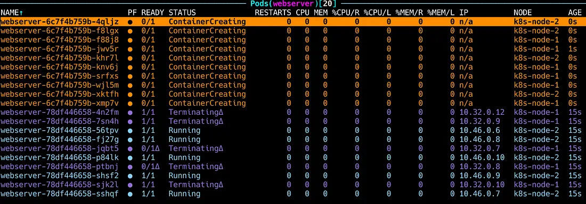
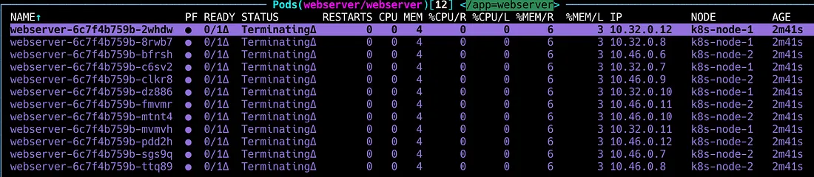

## Estratégias de Atualização de Deployments no Kubernetes

Quando criamos um **Deployment** no Kubernetes, não precisamos necessariamente definir uma estratégia de atualização. Nesse caso, o Kubernetes aplica automaticamente a estratégia padrão: **RollingUpdate**.

Mas você sabia que o Kubernetes oferece **duas estratégias principais** para atualizar seus Deployments?

- **RollingUpdate**
- **Recreate**

Essas estratégias definem como os Pods de um Deployment serão atualizados quando há alterações na definição do recurso — como uma nova imagem de container ou mudanças nas configurações.

## Estratégia RollingUpdate

A estratégia **RollingUpdate** é a **padrão** utilizada pelo Kubernetes para atualizar os Pods de um Deployment de forma **gradual** — ou seja, ela atualiza um Pod por vez ou em pequenos grupos, sem interromper todo o serviço de uma só vez.

Essa abordagem é ideal para garantir **alta disponibilidade** durante atualizações, principalmente em ambientes de produção.

---

### 🔧 Exemplo de Configuração

```yaml
apiVersion: apps/v1
kind: Deployment
metadata:
  name: webserver
spec: 
  replicas: 10
  selector: 
    matchLabels: 
      app: webserver
  strategy: 
    type: RollingUpdate
    rollingUpdate: 
      maxSurge: 5
      maxUnavailable: 5
  template:
    metadata:
      labels:
        app: webserver
    spec:
      containers:
        - name: nginx
          image: nginx:latest
```

### Explicação dos campos (type, maxSurge, maxUnavailable)

**type:** - Define o tipo de estratégia de atualização utilizada, neste caso, RollingUpdate.

**maxSurge: 5** - Durante o processo de atualização, o Kubernetes **pode criar até 5 Pods adicionais acima do número especificado em réplicas**. Isso significa que, temporariamente, **podemos ter até 15 Pods em execução (10 réplicas + 5 pods adicionais)** para acelerar a atualização sem aguardar os pods antigos sejam completamente encerrados.

**maxUnavailable: 5** - Define que, durante a atualização, **até 5 pods podem estar indisponíveis simultaneamente**. Isso significa que o Kubernetes **pode encerrar até metade dos pods antigos enquanto cria os novos**, mantendo um balanço entre disponibilidade e velocidade.

- Abaixo um exemplo de quando aplicamos uma atualização do Deployment utilizando a estratégia RollingUpdate.



## Estratégia Recreate

Ao contrário da RollingUpdate, a **Estratégia Recreate** interrompe todos os Pods atuais antes de iniciar novos. Isso significa que haverá um período em que nenhum Pod estará disponível.

Essa abordagem pode ser útil quando:

- O novo pod não pode coexistir com os antigos (por exemplo, mudança incompatível no banco de dados).

- Você quer garantir que todos os recursos antigos sejam encerrados antes da nova versão subir.

### 🔧 Exemplo de Configuração

```yaml
apiVersion: apps/v1
kind: Deployment
metadata:
  labels:
      app: webserver
  name: webserver
  namespace: webserver
spec:
  replicas: 12
  selector:
    matchLabels:
      app: webserver
  strategy:
    type: Recreate
  template:
    metadata:
      labels:
        app: webserver
    spec:
      containers:
      - name: nginx
        image: nginx:1.15.0
        
```
- A estratégia Recreate possui apenas a configuração do campo **type** ,pois ele remove todos os Pods antes de criar os novos.

- Abaixo um exemplo de quando aplicamos uma atualização do Deployment utilizando a estratégia Recreate.

